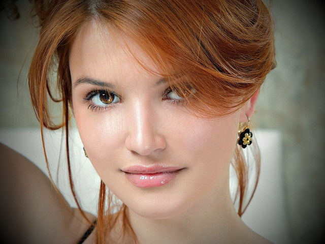

=========================================
Vignette
=========================================

Makes the edges of the photo less bright, creating an oval frame around its central part.

.. cpp:function:: int vignette(cv::InputArray src, cv::OutputArray dst, cv::Size rect)

   :param src: Source 8-bit three-channel image.
   :param dst: Destination image of the same size and the same type as **src**.
   :param rect: Size of rectangle describes an ellipse, whose center is at the center image.
   :return: Error code.

The algorithm.

#. Create a new 3-channel image, which is interpreted as BGR image.

#. For every channel calculate :math:`dist` and :math:`coefficient`, where
   :math:`dist` is a distance between the current pixel and the center of image;

   The :math:`dist` is calculated by the following 
   formula:

   .. math::

      dist = (y - centerRow) * (y - centerRow) / (a * a) +
      (x - centerCol) * (x - centerCol) / (b * b),

   where :math:`(x, y)` is a point of image, :math:`(centerCol, centerRow)` is a center of image, :math:`a` and :math:`b` are axis of the ellipse.

   :math:`coefficient` is a number which multiplies the intensity channel.

   The :math:`coefficient` is calculated by the following formula:

   .. math::

      coefficient = 1 - ((dist - 1) / radiusMax),
   
   where :math:`radiusMax` is a distance between the pixel (0, img_src.cols) and the center image.

#. Convert image to a BGR format.

Example.

|srcImage| |dstImage|

.. |srcImage| image:: vignette_before.jpg
   :width: 40%

